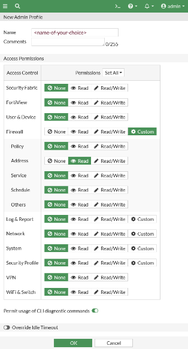
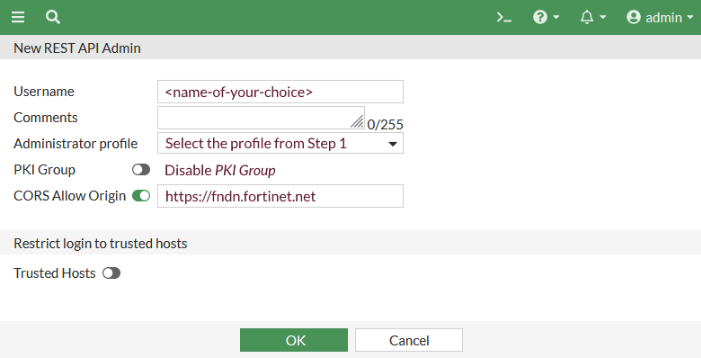
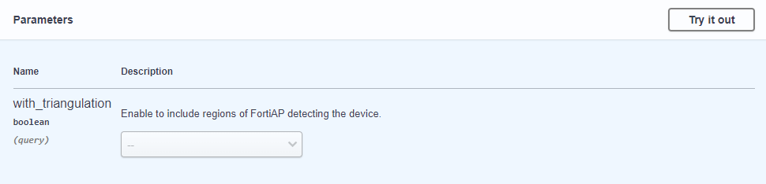
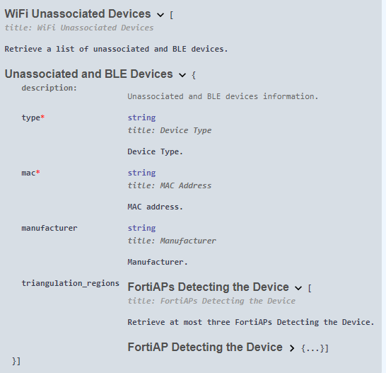
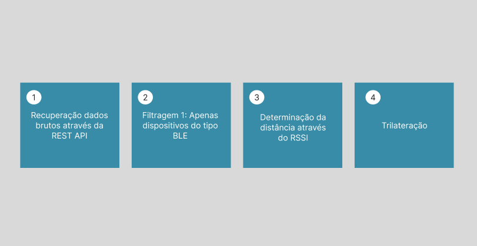
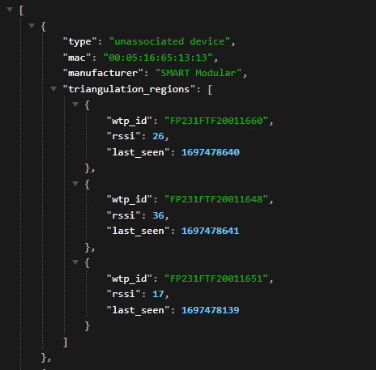
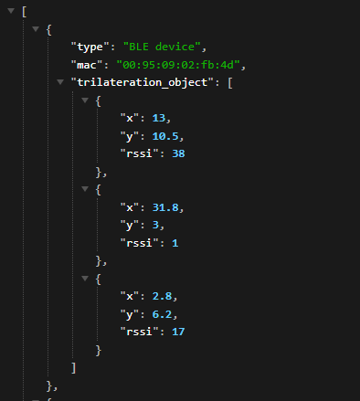
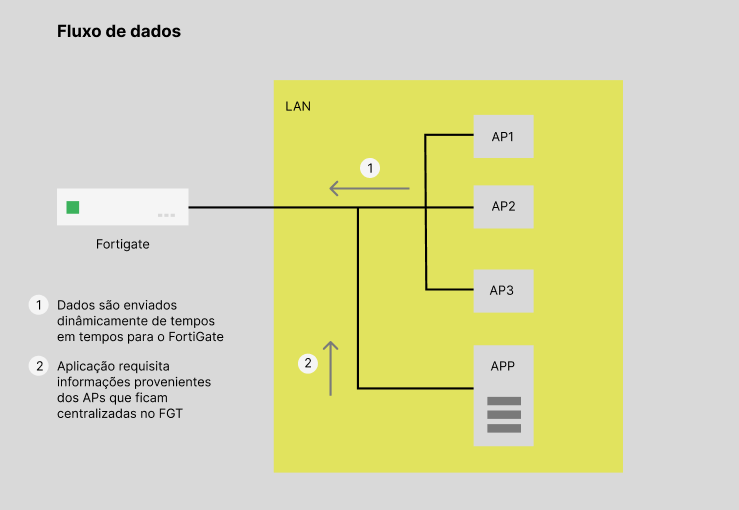
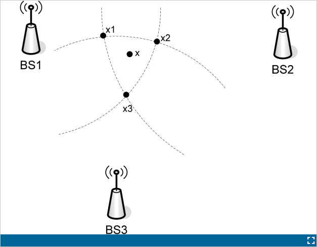

# Documentação de implementação - Solução IPS

## 1. Configurações de acesso - FNDN

### 1.1 Overview

A REST API da FortiNet permite realizar operações de configuração e monitoramente em um dispositivo FortiGate (Appliance ou VM). São suportados os seguintes tipos de API:

- **Configuração:** Realiza a **busca** e **modificação** de comandos que podem ser executados via CLI, como, por exemplo criar ou deletar uma regra de firewall ou mudar alguma das configurações do sistema.

- **Monitoramento:** Recupera dados de forma dinâmica e realiza operações de rede como : reiniciar, desligar ou realizar backup em uma appliance FortiGate;

- **Logs:** recupera/realiza download de logs dos mais diversos tipos (segurança, eventos na rede, eventos de sistema)

Cada uma das APIs é documentada de acordo com a versão do sistema operacional executado pelos dispositivos. 

### 1.2 Criação de perfis administrativos e geração do token de autenticação

Cada requisição às APIs REST disponíveis deve ser **autenticada** através de um **token**. A geração do Token é realizada dentro da appliance FGT que deseja se autenticar na API. Deve-se incialmente criar um perfil do tipo **admin**, onde serão configuradas as devidas permissões:

Como pode ser observado na imagem, existem diferentes níveis de permissão que podem ser atribuidos para cada uma das funcionalidades que podem ser acessadas via API.

Uma vez realizada a criação do perfil administrativo e configuradas suas devidas permissões, deve-se criar um perfil administrativo para REST API. Especifica-se um **nome de usuário** e realiza-se a **associação** do mesmo com o perfil administrativo configurado anteriormente. É possível também ativar um nível extra de segurança utilizando certificados. A opção **CORS allow origin** permite que a aplicação seja acessada por outras aplicações que utilizam JavaScript além do browser.

Isso é importante para garantir que uma terceira aplicação possa realizar a conexão segura com a API

## 1.3 API Request

Uma vez realizada a configurações dos perfis administrativos e gerado o token de acesso para autenticação, já é possível realizar requisições à máquina autorizada. Um exemplo de URL que pode ser utilizada para requisitar todos os endereços de firewall:

> https://(your-fortigate-address)/api/v2/cmdb/firewall/address/?access_token=(your-api-token)

As respostas são recebidas no formato JSON:

> {
  "http_method":"GET",
  "revision":"124.0.206.9538334086041268915.1559577065",
  "results":[
    {
      "q_origin_key":"AD-Server",
      "name":"AD-Server",
      "uuid":"********-****-****-****-************",
      "subnet":"10.100.77.240 255.255.255.255",
      "type":"ipmask",
      "start-mac":"00:00:00:00:00:00",
      "end-mac":"00:00:00:00:00:00",
      "start-ip":"10.100.77.240",
      "end-ip":"255.255.255.255",
      "fqdn":"",
      "country":"",
      "wildcard-fqdn":"",
      "cache-ttl":0,
      "wildcard":"10.100.99.240 255.255.255.255",
      "sdn":"",
      "interface":"",
      "tenant":"",
      "organization":"",
      "epg-name":"",
      "subnet-name":"",
      "sdn-tag":"",
      "policy-group":"",
      "comment":"",
      "visibility":"enable",
      "associated-interface":"",
      "color":0,
      "filter":"",
      "sdn-addr-type":"private",
      "obj-id":"",
      "list":[
      ],
      "tagging":[
      ],
      "allow-routing":"disable"
    },
    {
      "q_origin_key":"AWS-us-east-1a",
      "name":"AWS-us-east-1a",
      "uuid":"********-****-****-****-************",

## 1.4 FortiOS Monitor API

Como explicitado anteriormente, dentre as APIs disponibilizadas temos as do tipo de **monitoramento** com uma extensa lista de métodos que podem ser utilizados:

- azure
- casb
- endpoint-control
- extender-controller
- extension-controller
- firewall
- fortiguard
.
.
.
- wifi

Dentro da parte de **wifi** é possível recuperar dados referentes ao dispositivos **não associados (unassociated devices)**, tanto do tipo wifi - 802.11 quanto dispositivos do tipo BLE. Em uma rede sem fio (Wi-Fi), dispositivos não associados são dispositivos que ainda não estabeleceram uma conexão ativa com o ponto de acesso (AP) ou roteador sem fio. A associação é o processo pelo qual um dispositivo cliente se conecta à rede sem fio, autentica-se e obtém um endereço IP atribuído para poder comunicar-se com outros dispositivos e acessar a Internet, se aplicável.

As imagens a seguir apresentam o formato da assinatura da URL que acessa o método e seus respectivos campos de retorno:

Como pode ser observado, dentre as informações que podem ser recuperadas temos:

- **tipo:** Tipo de dispositivo associado;
- **mac:** Endereço MAC do dispositivo;
- **manufacturer**: 
- **triangulation_regions:** Apresenta os APs que entraram em contato com o dispositivo. Dentro deste parâmetro, existem ainda duas ramificações: **FortiAPs Detecting the device** que indica se existem pelo menos três APs que enxergam o dispositivo. **FortiAP Detecting the device** que traz informações individuais de cada AP acerca dos dispositivos próximos como **wtp_id**, **rssi**, **last_seen**.

De maneira resumida, pode-se dizer que o método recupera informações de dispositivos que passarm pelas proximidades dos pontos de acesso instalados na infraestrutura estudada. Objetiva-se através destes parâmetros realizar o **mapeamento em tempo real** do dispositivos do tipo **BLE**.

### 1.5 Configuração Aps

Para FortiAPs com rádios Bluetooth integrados, o FortiGate pode configurar a varredura FortiAP Bluetooth Low Energy (BLE) e integrar-se com vários perfis BLE Beacon. Para isso, é necessário configurar um perfil BLE, que pode ser atribuído à um perfil de fortiAP, configurado no Firewall.

    config wireless-controller wtp-profile
      edit <name>
        set ble-profile <name>
      next
    end

Deve-se também configurar o intervalo em que os dados são reportados para a unidade central (Fortigate):

    config wireless-controller timers
      set ble-scan-report-intv - (default = 30 sec)
    end

As configurações abaixo apresentam outros parâmetros configuráveis para o sacn de dispositivos BLE:

    config wireless-controller ble-profile
      edit "myBleProfile"
        set ble-scanning enable
        set scan-type passive
        set scan-period 1000
        set scan-interval 30
        set scan-window 30
      next
    end

Cada AP possui três radios operando. Duas faixas de frequência são utilizadas para transmissão comum de dados (2.5 GHz e 5.4 GHz), existe também uma terceira rádio que opera exclusivamente para fins de monitoramento. 

## 2 Procedimento adotado

## 3. Tratamento de dados

Como verificado na seção 1.3, apesar dos dados já estarem sendo devidamento direcionados apenas para os dispositivos não associados e do tipo BLE, ainda existem diversas informações não perminentes sendo ingeridas pela aplicação através do método GET. Afim de facilitar a manipulação dos dados e melhorar a performance da aplicação ao **consumir** e **armazenar** dados, foi realizado o tratamento dos dados para um formato mais enxuto.

A imagem acima apresenta o objeto já em um formato mais próximo do ideal. Importante ressaltar que a ferramenta devolve dispositivos não associados detectados por **ATÉ** 3 APs. Como deseja-se implementar o método da trilateração, é na verdade necessário que o dispositivo esteja sendo detectado por no mínimo 3 pontos de acesso. 

<!-- Problemas no desenvolvimento -->

Durante os processos de teste, utilizou-se apenas uma TAG BLE, dentro do ambiente corporativo da empresa, que contém 12 pontos de acesso ativo capturando os dados do dispositivo. Nem sempre (no início dos testes, quase nunca) a TAG é "enxergada" por mais de três APs dependendo de sua localização. Afim de contornar essa situação, foi necessário encontrar uma alternativa para realizar um cálculo de posição estimada com os dados provenientes de **menos de três pontos de acesso**. Quando se tem dados faltantes, existem diversas estratégias que podem ser utilizadas, como substituir os valores inexistentes por um valor de RSSI muito baixo, afim de indicar que o dispositivo não está sendo detectado pelos outros APs. O RSSI indica o nível de potência recebido após qualquer perda possível a nível de antena e cabo. Quanto maior o valor RSSI, maior é a intensidade do sinal. Quando medido em números negativos, o número que está mais perto de zero geralmente significa um sinal melhor. Como exemplo, -50 é um bom sinal, -75 é bastante razoável e -100 é nenhum sinal.

 O cálculo da trilateração é implementado recebendo três valores base: 

- Coordenada X do AP que "enxerga" o dispositivo detectado;
- Coordenada Y do AP que "enxerga" o dispositivo detectado;
- Distância d entre AP e dispositivo detectado

Para isso, realizou-se mais uma formatação dos dados coletados, dessa vez para o seguinte formato:

### 3.1 Regressão polinomial

### 3.2 Cálculo da distância baseado no valor do RSSI

Como pode ser observado nas imagens, o valor retornado pela entidade coletora é o RSSI. Para realizar a trilateração e consequentemente determinar uma posição estimada para o beacon BLE, foi necessário implementar no código funcionalidade que fosse capaz de realizar essa conversão.

Essa função, chamada **estimate_distance_from_rssi**, é usada para estimar a distância entre um dispositivo emissor e receptor com base no valor de RSSI (Received Signal Strength Indicator) capturado. O RSSI é uma medida da força do sinal de rádio transmitido entre esses dispositivos, e a função utiliza uma equação polinomial para fazer essa estimativa.

A equação utilizada na função é uma forma de modelo de **regressão polinomial**, que foi ajustada com base em dados experimentais para relacionar o RSSI com a distância entre os dispositivos. Aqui está como a função opera:

1. Coeficientes da equação: A função define coeficientes (w0, w1, w2, w3, w4) que representam os pesos atribuídos a diferentes termos da equação polinomial.

2. Intercepto: Também é definido um intercepto (intercept) que é adicionado ao resultado da equação para ajustar a estimativa à situação específica.

3. Cálculo da distância estimada: A função utiliza a seguinte equação polinomial para calcular a distância estimada com base no valor de RSSI:

        distância = intercept + w0 + w1 * rssi + w2 * (rssi^2) + w3 * (rssi^3) + w4 * (rssi^4)

Onde:
   - "rssi" é o valor de RSSI capturado.
   - "w0," "w1," "w2," "w3," "w4," e "intercept" são os coeficientes definidos anteriormente.

A função retorna o valor da "distância" estimada, que representa a distância entre os dispositivos com base no RSSI fornecido. Em resumo, a função utiliza uma equação polinomial ajustada previamente para mapear o RSSI em uma estimativa de distância, ajudando a determinar a proximidade entre os dispositivos em uma rede de comunicação sem fio.

## 4. Localização dos dispositivos não associados

[Trilateração com beacons bluetooth](C:/Users/pedro.picinin/Downloads/sensors-18-02820.pdf)

[PSO-BPNN - used to train the RSSI distance model to reduce the positioning
error](https://ieeexplore.ieee.org/document/4603226)

<!-- Exemplo JSON tratado -->

## Infraestrutura e fluxo de dados

O FortiGate é um NGFW responsável pela segurança da rede interna. Todos os pacotes que entram e saem da LAN passam obrigatoriamente pela entidade. Deve-se observar que são os **APs** que realizam a captura de dados dos dispositivos BLE e wifi não associados, mas todas as informações são centralizadas e podem ser consultadas apenas no FGT.

## 4. Trilateração

## Do artigo - Será que vale a pena tentar implementar esse algoritmo de correção da flutuação RSSI?

<!-- PEquena intro e principais algoritmos utilizados

Para este projeto, deve-se levar em consideração o fato do FGT ja devolver o valor RSSi de cada dispositivo não associado (beacon)
 -->

Low-power Bluetooth is favored in indoor positioning because of its advantages such as easy deployment, low power consumption, and low cost.In 2013, Apple introduced the iBeacon technology based on Bluetooth low-energy (BLE), which made BLE widely used in various indoor environments.

The positioning algorithms are mainly divided into two categories: 

- Received signal strength indication (RSSI) distance method ;

-  Wireless fingerprint positioning technology;

<!-- Aplicações tecnologia IPS com BLE -->

These applications can be used in many scenarios such as assets management, staff tracking, indoor tourist guiding in museums, train stations, airports, shopping complex etc. For example in European IST project ADAMANT (1), the researchers built an indoor information system for airport travellers and tailored location bases services were provided

(1):Wang, et al., "An Agent-based Passenger Support System over Heterogeneous Wireless Infrastructures in an Airport Environment, " in IASTED International Conference on Networks and Communication Systems (NCS 2006), Chiang Mai, Thailand, Mar 2006, pp. 240-244.

<!-- Triangulation -->

[Artigo de referência](https://ieeexplore.ieee.org/abstract/document/6488558?casa_token=0L5sZukRM3YAAAAA:hqHc38nxUYkhcCXsKrlnQA2vKXm1Idnc5SIVJzt7eW3bdsBsVddiJxAEB8vSi4siOaDFNp97SA)

Triangulation based positioning method is a well-studied method. The method **forms circles centred at the access points**, where the radius of each circle is determined by 

1) the measured signal strength of the mobile terminal OR

2) the time elapsed transmitting the signal between the access point and the mobile terminal. 

An intersection point arises when there are three or more access points within a certain range, and the intersection point gives the estimated location of the mobile terminal. In practice, it is almost impossible to obtain a single interaction point due to errors in measurements. The signal strength measurement can be affected by obstacles and imperfect propagation models used. For example in Fig. 1, there are three intersections points, the final position estimation of point x will be the **average coordinate** of intersection points x1, x2 and x3.

<!-- Mitigação de erro de precisão

vou contornar esse problema com um algoritmo de IA?
 -->

There are two main approaches to mitigate positioning error, the first is to choose and formulate a proper position algorithm, and the second is to improve the RSSI reading accuracy. As the radio signals changes quickly duo to fast fading effects, the instant RSSI readings may fluctuate and may not fit our path loss model. However, we can choose a filter to smooth the RSSI readings. The most commonly and easily achieved filters are average filter and weighting filter. These filters take several readings and average those to get a more accurate result that reflects the path loss model.

[Trilateração com node.js](https://journalofcloudcomputing.springeropen.com/articles/10.1186/s13677-019-0142-y)

[Artigo com uma boa descrição do desenvolvimento do projeto e das partes envolvidas](https://journalofcloudcomputing.springeropen.com/articles/10.1186/s13677-019-0142-y)

## Libs de triangulação JS

[nodejs lib](https://github.com/TBMSP/Trilateration)

## Pergunta

