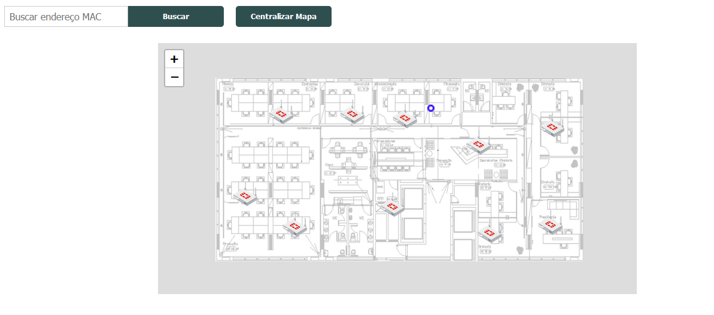

# Documentação de implementação - Solução IPS

## 1. Apresentação do problema

Através deste projeto, objetiva-se, de maneira geral, implementar um sistema de localização aplicado à ambientes internos - Indoor Positioning Sytem (IPS) - dentro de um ambiente corporativo em produção, cujos dispositivos componentes são integralmente pertencentes à fabricante Fortinet. Deve ser possível localizar a posição de pontos específicos e apresenta-los por meio de uma aplicação web.

Para isso, utilizar-se-á beacons BLE (Bluetooth Low Energy) associados às informações que podem ser coletadas pelos Access Points via API REST. Esta comunicação é efetivada por uma aplicação backend, afim de diminuir o processamento de dados que será realizado pela aplicação frontend.

Afim de obter uma boa precisão ao calcular o posicionamento dos pontos de interesse, serão utilizadas também técnicas de inteligência artificial e Deep Learning. Para garantir total compatibilidade com a infraestrutura onde será aplicada a solução, será criado também um dataset com amostras suficientes para realizar o treinamento do modelo preditor.

### 1.1 Entidades da arquitetura da solução

Como principais entidades que compõe o sistema, temos:

- Tags BLE;
- Acess Points;
- NGFW Fortigate;
- Aplicação Backend;
- Aplicação Frontend;

As **Tags BLE** são os dispositivos a serem localizados. Utilizados tanto para os testes quanto para a implementação final. Os **Access Points** são os dispositivos responsáveis pela realização da coleta das informações que serão utilizadas para determinação da localização das tags BLE. O **NGFW** é a entidade central que recebe os dados coletados e pode ser acessada por meio de uma REST API. As **aplicações Backend e Frontend** são responsáveis por aplicar de fato as funcionalidades da aplicação e apresenta-las ao usuário.

## 1.2 Fluxo de dados 

O FortiGate é um NGFW responsável pela segurança da rede interna. Todos os pacotes que entram e saem da LAN passam obrigatoriamente pela entidade. Deve-se observar que são os **APs** que realizam a captura de dados dos dispositivos BLE e wifi não associados, mas todas as informações são centralizadas e podem ser consultadas apenas no FGT.

<!-- ##  Procedimento adotado

 -->

## 2. Configurações iniciais - NGFW, API connection, Access Points

### 2.1 REST API

A REST API da FortiNet permite realizar operações de configuração e monitoramente em um dispositivo FortiGate (Appliance ou VM). São suportados os seguintes tipos de API:

- **Configuração:** Realiza a **busca** e **modificação** de comandos que podem ser executados via CLI, como, por exemplo criar ou deletar uma regra de firewall ou mudar alguma das configurações do sistema.

- **Monitoramento:** Recupera dados de forma dinâmica e realiza operações de rede como : reiniciar, desligar ou realizar backup em uma appliance FortiGate;

- **Logs:** recupera/realiza download de logs dos mais diversos tipos (segurança, eventos na rede, eventos de sistema)

Cada uma das APIs é documentada de acordo com a versão do sistema operacional executado pelos dispositivos. 

### 2.2 Criação de perfis administrativos e geração do token de autenticação

Cada requisição às APIs REST disponíveis deve ser **autenticada** através de um **token**. A geração do Token é realizada dentro da appliance FGT que deseja se autenticar na API. Deve-se incialmente criar um perfil do tipo **admin**, onde serão configuradas as devidas permissões:

Como pode ser observado na imagem, existem diferentes níveis de permissão que podem ser atribuidos para cada uma das funcionalidades que podem ser acessadas via API.

Uma vez realizada a criação do perfil administrativo e configuradas suas devidas permissões, deve-se criar um perfil administrativo para REST API. Especifica-se um **nome de usuário** e realiza-se a **associação** do mesmo com o perfil administrativo configurado anteriormente. É possível também ativar um nível extra de segurança utilizando certificados. A opção **CORS allow origin** permite que a aplicação seja acessada por outras aplicações que utilizam JavaScript além do browser.

Isso é importante para garantir que uma terceira aplicação possa realizar a conexão segura com a API

### 2.3 API Request

Uma vez realizada a configurações dos perfis administrativos e gerado o token de acesso para autenticação, já é possível realizar requisições à máquina autorizada. Um exemplo de URL que pode ser utilizada para requisitar todos os endereços de firewall:

> https://(your-fortigate-address)/api/v2/cmdb/firewall/address/?access_token=(your-api-token)

As respostas são recebidas no formato JSON:

> {
  "http_method":"GET",
  "revision":"124.0.206.9538334086041268915.1559577065",
  "results":[
    {
      "q_origin_key":"AD-Server",
      "name":"AD-Server",
      "uuid":"********-****-****-****-************",
      "subnet":"10.100.77.240 255.255.255.255",
      "type":"ipmask",
      "start-mac":"00:00:00:00:00:00",
      "end-mac":"00:00:00:00:00:00",
      "start-ip":"10.100.77.240",
      "end-ip":"255.255.255.255",
      "fqdn":"",
      "country":"",
      "wildcard-fqdn":"",
      "cache-ttl":0,
      "wildcard":"10.100.99.240 255.255.255.255",
      "sdn":"",
      "interface":"",
      "tenant":"",
      "organization":"",
      "epg-name":"",
      "subnet-name":"",
      "sdn-tag":"",
      "policy-group":"",
      "comment":"",
      "visibility":"enable",
      "associated-interface":"",
      "color":0,
      "filter":"",
      "sdn-addr-type":"private",
      "obj-id":"",
      "list":[
      ],
      "tagging":[
      ],
      "allow-routing":"disable"
    },
    {
      "q_origin_key":"AWS-us-east-1a",
      "name":"AWS-us-east-1a",
      "uuid":"********-****-****-****-************",

### 2.4 FortiOS Monitor API

Como explicitado anteriormente, dentre as APIs disponibilizadas temos as do tipo de **monitoramento** com uma extensa lista de métodos que podem ser utilizados:

- azure
- casb
- endpoint-control
- extender-controller
- extension-controller
- firewall
- fortiguard
- wifi

Dentro da parte de **wifi** é possível recuperar dados referentes ao dispositivos **não associados (unassociated devices)**, tanto do tipo wifi - 802.11 quanto dispositivos do tipo BLE. Em uma rede sem fio (Wi-Fi), dispositivos não associados são dispositivos que ainda não estabeleceram uma conexão ativa com o ponto de acesso (AP) ou roteador sem fio. A associação é o processo pelo qual um dispositivo cliente se conecta à rede sem fio, autentica-se e obtém um endereço IP atribuído para poder comunicar-se com outros dispositivos e acessar a Internet, se aplicável.

As imagens a seguir apresentam o formato da assinatura da URL que acessa o método e seus respectivos campos de retorno:

Como pode ser observado, dentre as informações que podem ser recuperadas temos:

- **tipo:** Tipo de dispositivo associado;
- **mac:** Endereço MAC do dispositivo;
- **manufacturer**: 
- **triangulation_regions:** Apresenta os APs que entraram em contato com o dispositivo. Dentro deste parâmetro, existem ainda duas ramificações: **FortiAPs Detecting the device** que indica se existem pelo menos três APs que enxergam o dispositivo. **FortiAP Detecting the device** que traz informações individuais de cada AP acerca dos dispositivos próximos como **wtp_id**, **rssi**, **last_seen**.

De maneira resumida, pode-se dizer que o método recupera informações de dispositivos que passarm pelas proximidades dos pontos de acesso instalados na infraestrutura estudada. Objetiva-se através destes parâmetros realizar o **mapeamento em tempo real** do dispositivos do tipo **BLE**.

### 2.5 Configuração Aps

Para os modelos de Acess Point operantes, existem três canais de rádio disponíveis. Dois deles são dedicados às comunicações sem fio convencionais, 2.5 GHz e 5.4 GHz. Existe também uma terceira rádio que opera exclusivamente para monitoramento da rede. Por meio desta rede, é possível identificar os dispositivos BLE não associados nas proximidades. Inicialmente é necessário configurar um perfil de SCAN BLE para posteriormente aplica-lo ao perfil de configuração geral do Access Point 

    config wireless-controller wtp-profile
      edit <name>
        set ble-profile <name>
      next
    end

Deve-se também configurar o intervalo em que os dados são reportados para a unidade central (Fortigate), bem como outros parâmetros relevantes para a comunicação dos dispositivos:

    config wireless-controller timers
      set ble-scan-report-intv - (default = 30 sec)
    end

Abaixo são apresentadas as configurações do perfil BLE criado:

    config wireless-controller ble-profile
      edit "myBleProfile"
        set ble-scanning enable
        set scan-type passive
        set scan-period 1000
        set scan-interval 30
        set scan-window 30
      next
    end

### 2.6 Configurações FortiGate: Vinculando o NGFW aos pontos de acesso configurados

- Aplicação das configurações dos APs no NGFW

## 3. Aplicação Backend - Recuperação e tratamento dos dados monitorados

- Divisão entre front/backend
- Linguagem e framework utilizado
- Bibliotecas auxiliares instaladas e suas respectivas finalidades
- Tratamento dos dados: filtros aplicados
- Documentação de como acessar os dados - Como eles são acessados pela aplicação frontend?

## 4. Determinação da localização

- Como será feita a determinação da localização?
- Técnica do MVP: trilateração
- Print demonstrando erro de precisão utilizando esta tecnica puramente
- Como a inteligencia artificial pode ajudar no problema
- Estado da arte: para este problema, quais algoritmos seriam interessantes? 

## 5. Dataset - Fingerprint database

- Documentação de como foi criado o banco com os dados que serão utilizados para treinamento da IA.
- Apresentação da planta, pontos conhecidos

## 6. Treinamento dos Modelos preditivos

## 3. Tratamento de dados

Como verificado na seção 1.3, apesar dos dados já estarem sendo devidamento direcionados apenas para os dispositivos não associados e do tipo BLE, ainda existem diversas informações não perminentes sendo ingeridas pela aplicação através do método GET. Afim de facilitar a manipulação dos dados e melhorar a performance da aplicação ao **consumir** e **armazenar** dados, foi realizado o tratamento dos dados para um formato mais enxuto.

A imagem acima apresenta o objeto já em um formato mais próximo do ideal. Importante ressaltar que a ferramenta devolve dispositivos não associados detectados por **ATÉ** 3 APs. Como deseja-se implementar o método da trilateração, é na verdade necessário que o dispositivo esteja sendo detectado por no mínimo 3 pontos de acesso. 

## 4.Frontend

### (MVP!!!)3.2 Cálculo da distância baseado no valor do RSSI - aplicação da IA no código para melhorar a precisão da localização

Como pode ser observado nas imagens, o valor retornado pela entidade coletora é o RSSI. Para realizar a trilateração e consequentemente determinar uma posição estimada para o beacon BLE, foi necessário implementar no código funcionalidade que fosse capaz de realizar essa conversão.

Essa função, chamada **estimate_distance_from_rssi**, é usada para estimar a distância entre um dispositivo emissor e receptor com base no valor de RSSI (Received Signal Strength Indicator) capturado. O RSSI é uma medida da força do sinal de rádio transmitido entre esses dispositivos, e a função utiliza uma equação polinomial para fazer essa estimativa.

A equação utilizada na função é uma forma de modelo de **regressão polinomial**, que foi ajustada com base em dados experimentais para relacionar o RSSI com a distância entre os dispositivos. Aqui está como a função opera:

1. Coeficientes da equação: A função define coeficientes (w0, w1, w2, w3, w4) que representam os pesos atribuídos a diferentes termos da equação polinomial.

2. Intercepto: Também é definido um intercepto (intercept) que é adicionado ao resultado da equação para ajustar a estimativa à situação específica.

3. Cálculo da distância estimada: A função utiliza a seguinte equação polinomial para calcular a distância estimada com base no valor de RSSI:

        distância = intercept + w0 + w1 * rssi + w2 * (rssi^2) + w3 * (rssi^3) + w4 * (rssi^4)

Onde:
   - "rssi" é o valor de RSSI capturado.
   - "w0," "w1," "w2," "w3," "w4," e "intercept" são os coeficientes definidos anteriormente.

A função retorna o valor da "distância" estimada, que representa a distância entre os dispositivos com base no RSSI fornecido. Em resumo, a função utiliza uma equação polinomial ajustada previamente para mapear o RSSI em uma estimativa de distância, ajudando a determinar a proximidade entre os dispositivos em uma rede de comunicação sem fio.

